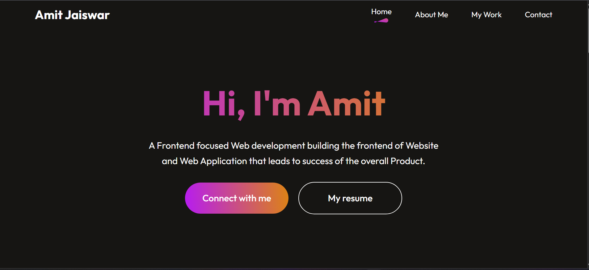

# React + Vite

This template provides a minimal setup to get React working in Vite with HMR and some ESLint rules.

Currently, two official plugins are available:

- [@vitejs/plugin-react](https://github.com/vitejs/vite-plugin-react/blob/main/packages/plugin-react/README.md) uses [Babel](https://babeljs.io/) for Fast Refresh
- [@vitejs/plugin-react-swc](https://github.com/vitejs/vite-plugin-react-swc) uses [SWC](https://swc.rs/) for Fast Refresh
# Portfolio React

This is my personal portfolio website built using **React.js**.  
I developed this project during my college time to showcase my projects, skills, and resume in a clean and responsive design.  
It reflects my learning journey and serves as a platform to highlight my work.

---

## 🚀 Features
- Responsive and modern UI
- Projects showcase
- Downloadable resume
- Contact form with icons

---

## 🖼️ Preview

---

## 🛠️ Tech Stack
- React.js + Vite
- HTML5 / CSS3
- JavaScript (ES6+)

---

## Connect with me
[LinkedIn Profile](https://www.linkedin.com/in/amitjaiswar04)
